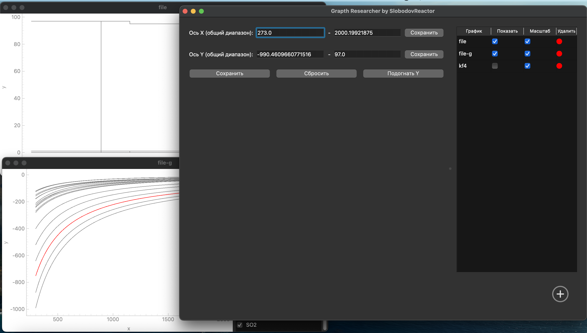

# Grapth Researcher

**Grapth Researcher** — это кроссплатформенное приложение для анализа и визуализации графиков, созданное на Python с использованием PySide6 и PyQtGraph.  
Оно специально разработано для анализа выходных данных термодинамического моделирования химических процессов сервиса SlobodovReactor, но также может использоваться для любых данных в табличном формате.

 

---

## 🔍 Возможности

- Загрузка табличных данных (CSV)
- Отображение графиков с гибкой настройкой осей
- Переключение масштабирования и логарифмирования
- Быстрое скрытие/отображение отдельных графиков
- Сохранение и загрузка проектов
- Экспорт графиков в изображение

---

## 📦 Установка

Требуется Python 3.9+

```bash
pip install -r requirements.txt
python main.py
